# Trade School App - AI驱动的校园交流交易平台

🔥 使用AI工具从零到一，一天落地一款校园应用！创意→需求→设计→开发→多端适配，全程AI干活！用AI加速你的创新之路！🚀 

- **总耗时约6小时**
- **支持Web + iOS + Android + 微信小程序 + 支付宝小程序**
- **100%AI生成代码**

## 🚀 快速开始
```
npm install
npm run dev
```


### 📸 项目展示

<table>
<tr>
<td align="center">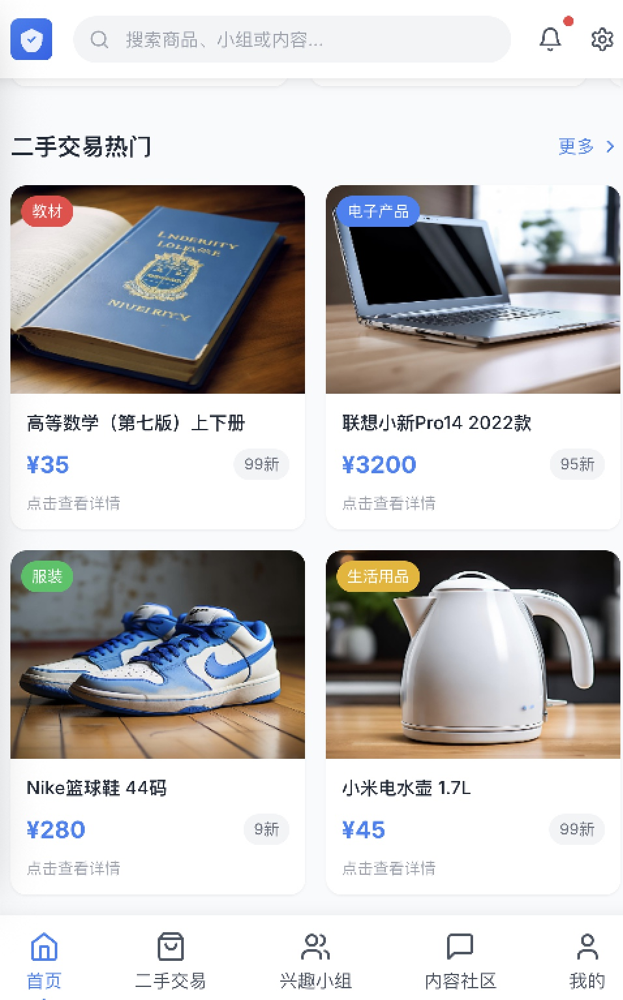</td>
<td align="center">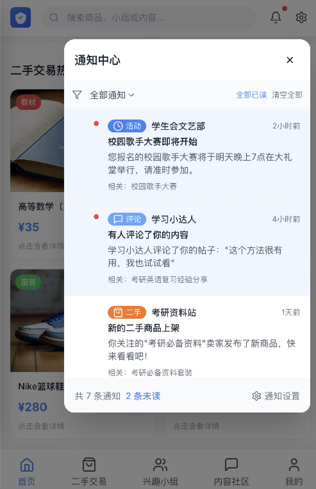</td>
<td align="center">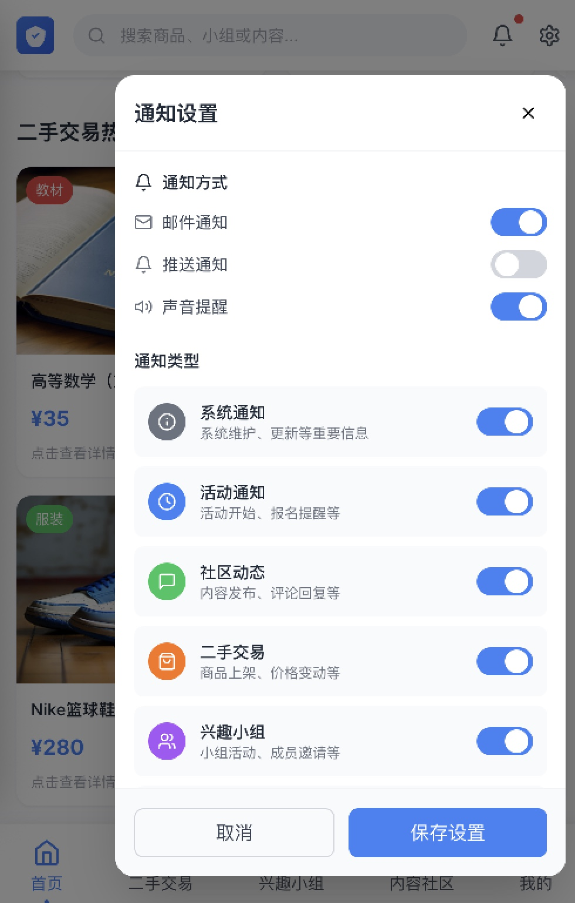</td>
<td align="center">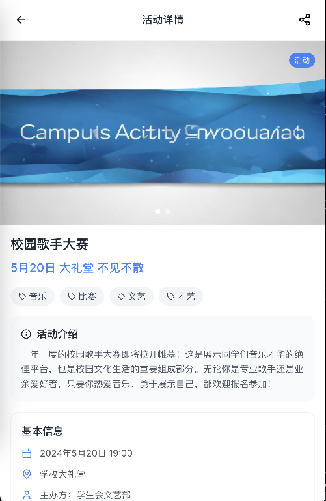</td>
</tr>
<tr>
<td align="center">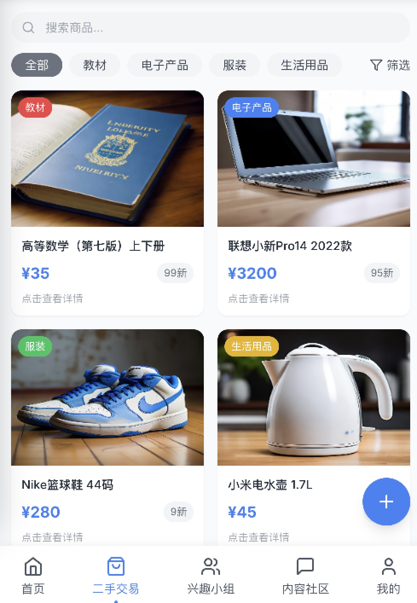</td>
<td align="center">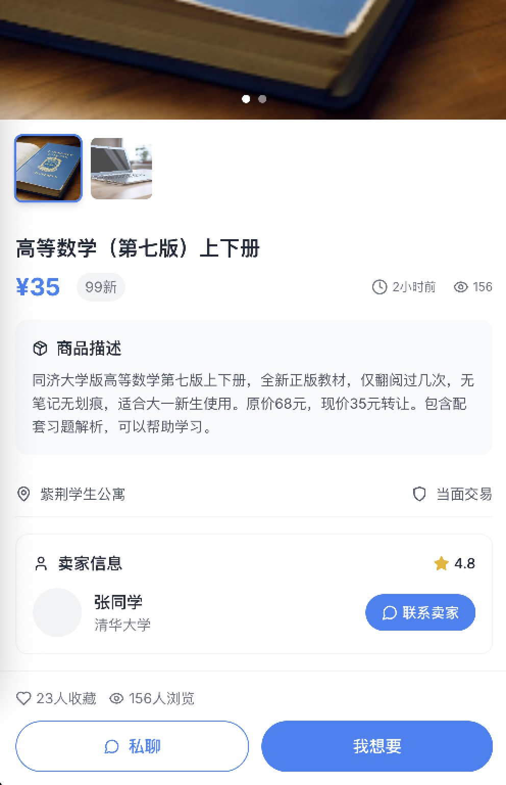</td>
<td align="center">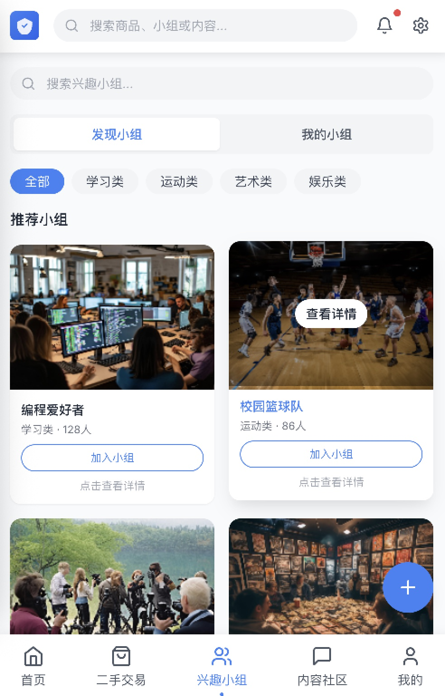</td>
<td align="center">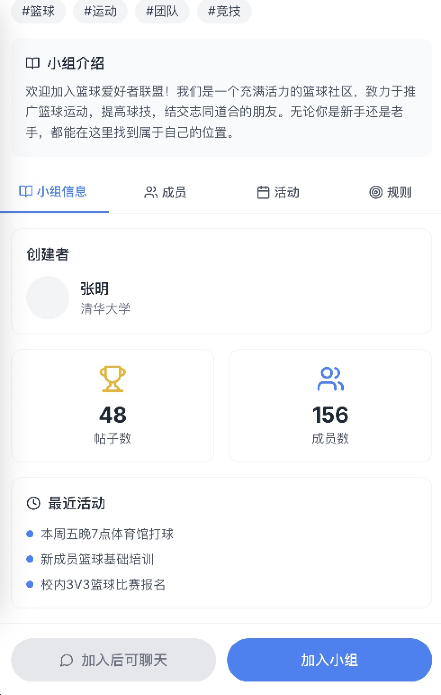</td>
</tr>
<tr>
<td align="center">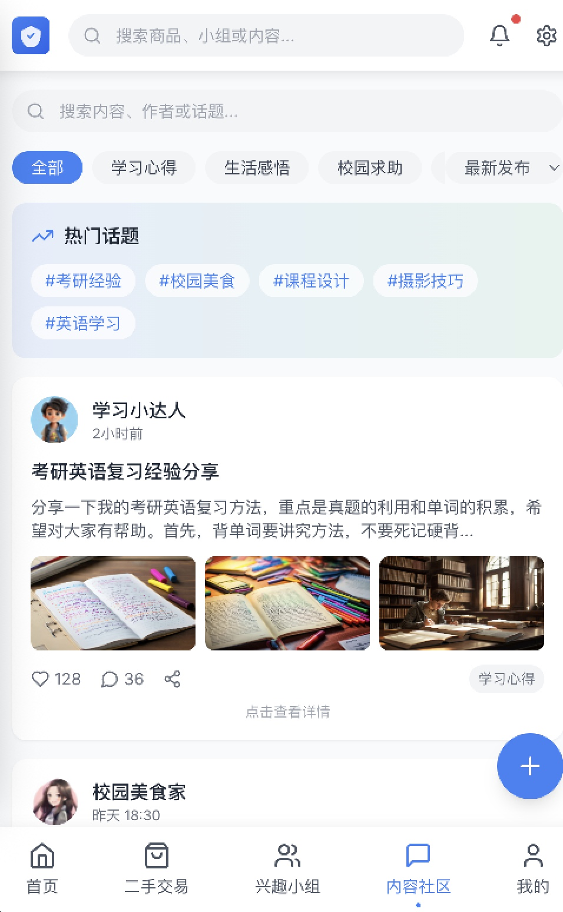</td>
<td align="center"></td>
<td align="center">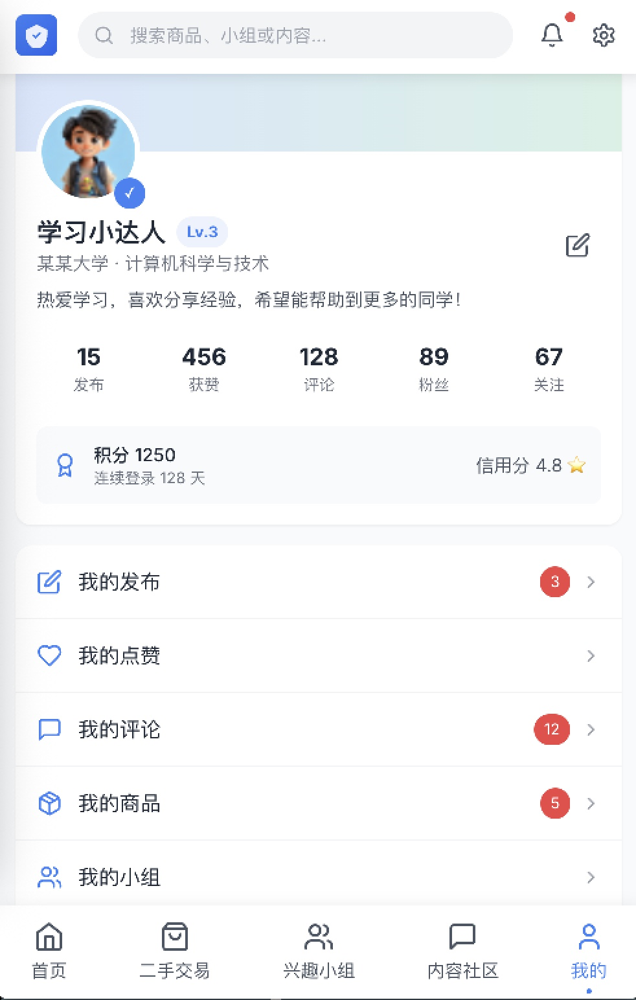</td>
<td align="center">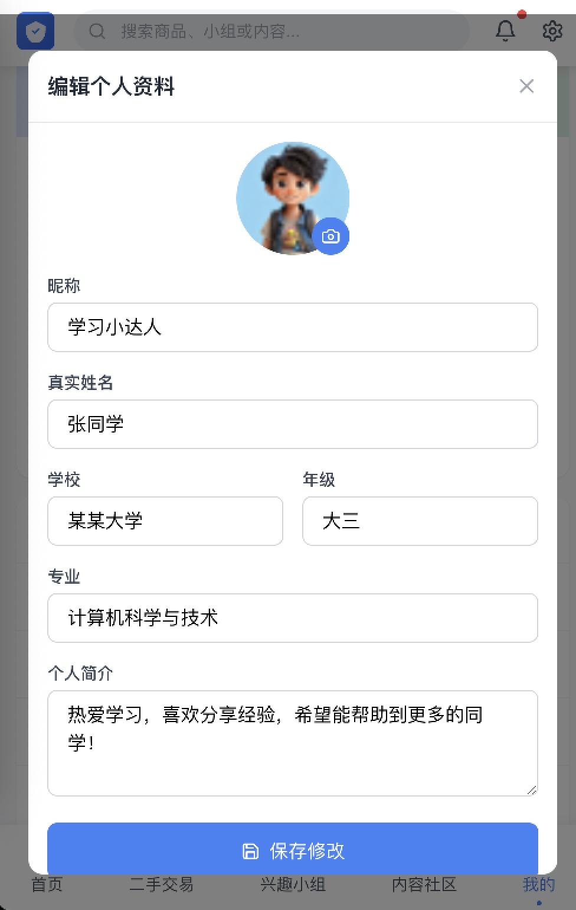</td>
</tr>
</table>

---

## 📋 我的AI开发流程

### 1. 创意构思
**用 AI-product-development-tools 模板工程生成产品** :将idea填入prd模板，如"我想开发一个校园交流交易平台，功能大概有活动发布和二手交易功能" 如 [prd需求](prd需求.md)  (备注：需避免过度设计)

### 2. UI设计
**带着详细需求去 gemDesign 设计UI 文档**: 如 [gemDesign原型导出](gemDesign原型导出.html) （备注: 一次生成好别乱改）

### 3. 前端项目开发
**带着导出的html去ClaudeCode + GLM-4.6 生成前端代码**: "prompt: 根据导出html生成前端代码，需要保证功能完整，允许构造数据" 

### 4. 前端功能完善
**检查并完善**: "prompt：完善首页tab、二手交易tab、兴趣小组tab、内容社区tab、我的tab，页面风格统一简约友好，需要保证功能完整，允许构造数据"

### 5. 生成后端api接口
 **根据前端页面生成完整后端api接口** ：生成后端接口服务"promt: 根据接口文档生成springboot项目并实现所有接口，允许mock数据，生成后自己检查验证并生成测试报告"
 
### 6. 跨平台转换

#### iOS/Android应用
 **AI提示词**: "prompt:使用Capacitor将React Web应用转换为iOS和Android原生应用，包含完整的配置和打包流程" 随后在android studio或xcode打开编译运行（备注：Capacitor适合交互不多快速转换的普通项目，Solito适合交互复杂项目，taro适合转小程序） 

#### 小程序转换
 **转换小程序如微信抖音支付宝**: "prompt：使用Taro框架将应用转换为微信小程序，实现页面适配和小程序特有功能" （备注：视觉变化可能较大，需要多次调整，不建议直接转）

---

## 🛠 主要工具

### AI工具
- **Claude Code**: AI编程助手
- **AI Product Development**: 产品需求生成
- **gemDesign**: UI设计辅助

### 开发框架
- **Web**: Next.js
- **移动端**: Capacitor
- **小程序**: Taro


---

## 📚 沟通交流 
 
